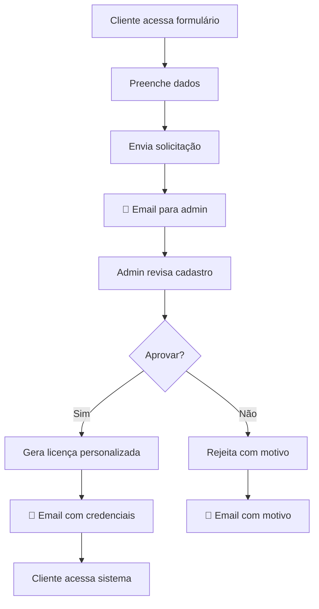

# 🔐 Sistema de Licenciamento - Agenda Salão

## 📋 Funcionalidades Implementadas

### 1. **Cadastro Público de Usuários**
- Formulário completo para solicitar acesso
- Validação de dados obrigatórios
- Envio automático de notificação para admin
- Interface responsiva e elegante

### 2. **Painel Administrativo**
- Visualização de cadastros pendentes
- Gerador de licenças personalizado
- Seleção de recursos por cliente
- Configuração de limites personalizados

### 3. **Sistema de Licenças**
- 12 recursos disponíveis (Agenda, Clientes, Produtos, etc.)
- 4 planos pré-definidos (Básico, Profissional, Premium, Enterprise)
- Limites configuráveis (usuários, clientes, duração)
- Chaves de ativação únicas

### 4. **Notificações por Email**
- Template para novo cadastro (admin)
- Template para licença aprovada (cliente)
- Template para licença rejeitada
- Template para renovação

## 🚀 Como Usar o Sistema

### **Para Clientes (Solicitar Acesso):**

1. **Acesse o Cadastro Público:**
   - No menu lateral: "Cadastro Público"
   - Ou acesse diretamente a URL: `/cadastro-publico`

2. **Preencha o Formulário:**
   ```
   ✅ Nome completo *
   ✅ Email *
   ✅ Nome da empresa/salão *
   ✅ Cidade/Estado *
   📋 Telefone, CNPJ, endereço (opcionais)
   💬 Observações (opcional)
   ```

3. **Envie a Solicitação:**
   - Clique em "Solicitar Acesso ao Sistema"
   - Aguarde confirmação na tela
   - Você receberá um email quando aprovado

### **Para Administradores (Gerar Licenças):**

1. **Acesse o Painel Admin:**
   - No menu lateral: "Admin - Licenças"
   - Ou acesse: `/admin-licencas`

2. **Veja Cadastros Pendentes:**
   - Tab "Cadastros Pendentes"
   - Revise dados do solicitante
   - Clique "✅ Gerar Licença"

3. **Personalize a Licença:**
   ```
   📋 Selecione um plano base
   ⚙️ Marque/desmarque recursos
   📊 Configure limites:
      • Máx. usuários
      • Máx. clientes  
      • Duração (dias)
   ```

4. **Gere e Envie:**
   - Revise o resumo
   - Clique "🔑 Gerar Licença e Enviar Email"
   - Cliente receberá email com credenciais

## 📦 Recursos Disponíveis

### **Básicos:**
- 📅 **Sistema de Agendamentos** - Calendário e notificações
- 👥 **Gestão de Clientes** - Cadastro e histórico
- 💇‍♀️ **Catálogo de Serviços** - Preços e duração

### **Intermediários:**
- 👨‍💼 **Gestão de Funcionários** - Escalas e comissões
- 📦 **Controle de Estoque** - Produtos e vendas
- 💰 **Controle Financeiro** - Fluxo de caixa
- ☁️ **Backup Automático** - Segurança dos dados

### **Avançados:**
- 📊 **Relatórios Avançados** - Dashboards e análises
- 📢 **Marketing Digital** - Campanhas e promoções
- 🏢 **Multi-estabelecimentos** - Múltiplas unidades
- 🔗 **Integração API** - Sistemas externos
- 📱 **Integração WhatsApp** - Notificações automáticas

## 🎯 Planos Pré-definidos

### **🥉 Básico - R$ 29,90/mês**
- Recursos: Agenda + Clientes + Serviços
- Máx. 2 usuários, 500 clientes
- Suporte básico

### **🥈 Profissional - R$ 59,90/mês**
- Recursos: Básicos + Funcionários + Produtos + Financeiro + Backup
- Máx. 5 usuários, 2.000 clientes
- Suporte premium

### **🥇 Premium - R$ 99,90/mês**
- Recursos: Profissionais + Relatórios + Marketing + WhatsApp
- Máx. 10 usuários, 5.000 clientes
- Suporte VIP

### **💎 Enterprise - R$ 199,90/mês**
- Todos os recursos inclusos
- Usuários e clientes ilimitados
- Suporte VIP + Multi-local + API

## 🔧 Fluxo do Sistema



## 📧 Templates de Email

### **Admin - Novo Cadastro:**
```
Assunto: [AGENDA SALÃO] Novo cadastro: {empresa}

• Nome: {nome}
• Email: {email}  
• Empresa: {empresa}
• Cidade: {cidade}/{estado}

Link do painel: https://agendasalao.com/admin
```

### **Cliente - Licença Aprovada:**
```
Assunto: 🎉 Sua licença do Agenda Salão foi aprovada!

🔑 Chave de Ativação: {chave}
📅 Válida até: {vencimento}
🎯 Plano: {plano}

Acesse: https://agendasalao.com/login
```

## 🛠️ Implementação Técnica

### **Arquivos Criados:**
- `src/types/license.ts` - Tipos e interfaces
- `src/components/PublicRegistrationForm.tsx` - Formulário público
- `src/components/AdminLicenseManager.tsx` - Painel administrativo
- `src/services/emailService.ts` - Sistema de emails

### **Integração:**
- Componentes integrados no `MainApp.tsx`
- Rotas adicionadas no menu lateral
- Sistema de notificações implementado

### **Próximos Passos:**
1. **Integrar com backend real**
2. **Configurar serviço de email** (SendGrid, AWS SES)
3. **Adicionar banco de dados** (PostgreSQL, MongoDB)
4. **Implementar autenticação** com licenças
5. **Criar sistema de pagamentos**

## 🎨 Interface

O sistema mantém o design glassmorphism do projeto:
- **Cores:** Gradiente roxo/rosa
- **Efeitos:** Backdrop blur, transparências
- **Responsivo:** Mobile-first design
- **Acessível:** Boa navegação e contraste

---

✨ **Sistema de licenciamento completo implementado!** 

Agora você pode:
1. Receber cadastros automaticamente
2. Gerar licenças personalizadas  
3. Enviar credenciais por email
4. Controlar recursos por cliente

🚀 **Pronto para produção após integração com backend e email real!**